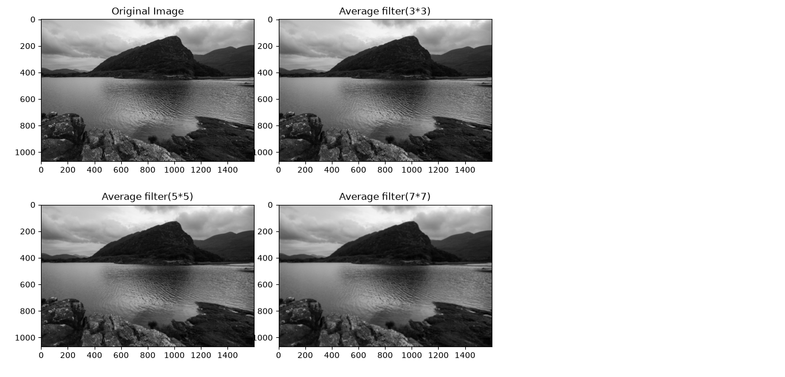

# Average Filtering Using OpenCV

## Overview:

This project demonstrates image smoothing using average filtering with OpenCV. The program reads a grayscale image and applies three different average filters: 3×3, 5×5, and 7×7.

The filtered images are displayed along with the original image so that the effect of different kernel sizes can be easily compared.

## Features:

- Reads an image in grayscale.
- Applies average filtering using 3×3, 5×5, and 7×7 kernels.
- Uses 2D convolution with OpenCV.
- Displays the original and filtered images together.
- Helps understand how kernel size affects image smoothing.

## Technologies Used:

- Python
- OpenCV
- NumPy
- Matplotlib

## Project Structure

```text
CV_Filtering/
│
├── filtering.py
├── images.jpg
├── output.png
└── README.md
```

## Requirements:

Install the required Python libraries before running the program:

pip install opencv-python numpy matplotlib

**If "pip" is not recognized, use:**
```text
python -m pip install opencv-python numpy matplotlib
```
## How to Run:

1. Clone or download this repository.
2. Place the input image as "images.jpg" in the same folder as "filtering.py".
3. Open the project in VS Code or any Python IDE.
4. **Run the following command:**
```text
python filtering.py
```

## The program displays four images:

- Original Image
- Average Filter (3×3)
- Average Filter (5×5)
- Average Filter (7×7)

## How It Works:

An average filter replaces each pixel with the average value of the pixels in its neighborhood.

**The program creates three kernels:**
```text
kernel_3_3 = np.ones((3,3), np.float32) / 9
kernel_5_5 = np.ones((5,5), np.float32) / 25
kernel_7_7 = np.ones((7,7), np.float32) / 49
```

These kernels are applied to the image using OpenCV's "filter2D()" function:
```text
blur_3_3 = cv2.filter2D(img, -1, kernel_3_3)
blur_5_5 = cv2.filter2D(img, -1, kernel_5_5)
blur_7_7 = cv2.filter2D(img, -1, kernel_7_7)
```

## Output:

The output below shows the original image and the results obtained using the 3×3, 5×5, and 7×7 average filters.




As the kernel size increases, the image becomes progressively smoother and some fine details are reduced.

**Filter Comparison:**

- 3×3 filter: Provides slight smoothing while preserving more details.
- 5×5 filter: Produces more noticeable smoothing and reduces fine details.
- 7×7 filter: Produces the strongest smoothing with greater loss of image details.

This comparison demonstrates how the kernel size affects image smoothing.

## Applications:

**Average filtering can be used for:**

- Image smoothing
- Noise reduction
- Image preprocessing
- Computer vision applications
- Removing small variations in images
- Preparing images for further image-processing operations

## Conclusion:

This project provides a simple demonstration of average filtering using OpenCV. By comparing 3×3, 5×5, and 7×7 kernels, we can observe how increasing the filter size affects image smoothness and image details.

## Author:

**Surya Prakash Balusu**

**CSE – Artificial Intelligence & Machine Learning**